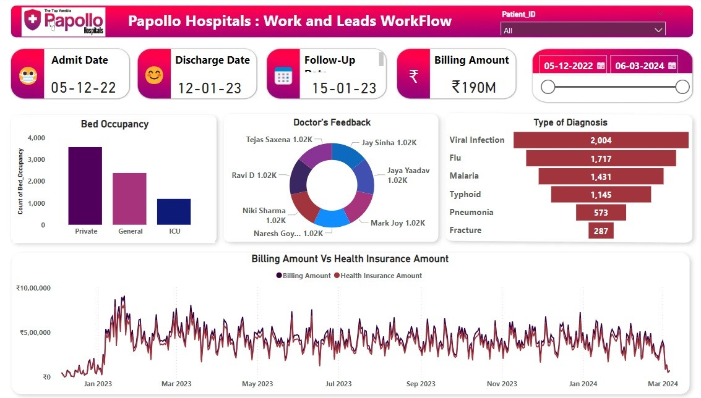

# 🏥 Healthcare Workflow Analysis Dashboard  

This **Power BI Dashboard** provides insights into hospital operations, patient admissions, discharge trends, doctor feedback, and billing trends.

## 📊 Key Insights  

1️⃣ **Patient Admissions & Discharge Analysis**  
   - Tracks the number of patients admitted and discharged over time.  
   - Identifies peak admission periods and average length of stay.  

2️⃣ **Bed Occupancy & Hospital Capacity**  
   - Displays bed availability and occupancy rates.  
   - Helps in optimizing hospital resource allocation.  

3️⃣ **Billing & Revenue Trends**  
   - Analyzes total billing amounts and insurance claims.  
   - Helps understand revenue sources and trends.  

4️⃣ **Doctor Feedback & Performance Analysis**  
   - Tracks patient feedback scores for different doctors.  
   - Identifies top-rated healthcare providers.  

5️⃣ **Diagnosis & Treatment Patterns**  
   - Highlights common diagnoses and treatments provided.  
   - Helps improve hospital efficiency and patient care strategies.  

---

## 📸 Dashboard Preview  

  

---

## 📂 Files Included  

| File Name                   | Description |
|-----------------------------|-------------|
| **Healthcare Dashboard.jpg** | Screenshot of the dashboard |
| **Healthcare Dashboard.pbix** | Power BI file for interactive exploration |
---

## 🚀 How to Use  

### **1️⃣ View the Dashboard**  
- Open `Healthcare.jpg` to see a snapshot of the insights.  

### **2️⃣ Explore in Power BI**  
1. Download `Healthcare Dashboard.pbix`.  
2. Open it in **Power BI Desktop**.  
3. Interact with the filters and visualizations.  

### **3️⃣ Analyze the Dataset (Optional)**  
- Download `Healthcare Data.xlsx` to review the raw data.  

---

## ⚡ Technologies Used  

- **Power BI** – For data visualization.
